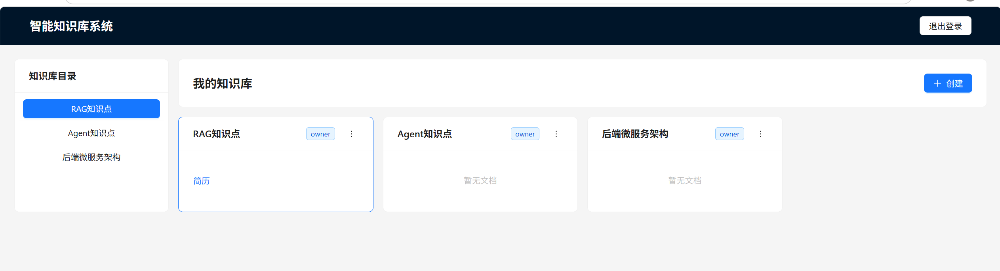

# 智能知识库管理系统（KB System）

一个面向个人/团队的知识管理与问答系统，支持：

- 多知识库管理
- 文档上传解析与在线编辑
- 文档版本与回滚
- 文档向量化索引
- 基于知识库的 RAG 问答（SSE 流式返回 + 引用来源）

---

## 项目预览



---

## 核心功能

### 1) 认证与权限
- JWT 认证（Access Token + Refresh Token）
- 知识库成员角色：`owner / editor / viewer`
- 按知识库做数据隔离与权限校验

### 2) 知识库管理
- 创建、重命名、删除知识库
- 成员管理（新增/修改/删除成员角色）
- 删除知识库时级联清理文档、版本、向量数据

### 3) 文档管理
- 新建文档、重命名文档、删除文档
- 上传并解析 `md / pdf / docx`
- 解析状态流转：`uploading / parsing / parsed / failed`
- 编辑器支持手动保存与自动保存（5 分钟有改动才触发）

### 4) 版本控制
- 每次保存生成新版本
- 历史版本查看
- 回滚到指定版本（生成新版本）
- 乐观锁并发校验（避免并发覆盖）

### 5) 向量索引与 RAG
- 文档分块后提取向量写入 `pgvector`
- 手动“提取到向量知识库”（重建时先删旧向量）
- RAG 问答链路：向量召回 -> LLM 生成 -> 引用来源返回
- 前端问答页支持会话持久化、引用跳转、引用片段高亮提示

### 6) 审计日志
- 基于 `@AuditLog + AOP + Async Event` 的写操作留痕
- 记录操作对象、动作、状态、耗时、错误信息

---

## 技术栈

### 后端
- Java 17
- Spring Boot 3.2
- MyBatis-Plus
- PostgreSQL 16 + pgvector
- JWT
- Maven

### 前端
- React 18 + TypeScript
- Vite 5
- Ant Design 5
- Zustand
- Axios
- Vditor

---

## 项目结构

```text
kb_system/
  backend/   # Spring Boot 后端
  frontend/  # React 前端
```

---

## 快速启动

## 1. 启动数据库（Docker）

确保本机有 Docker，启动 PostgreSQL（pgvector）容器。

## 2. 启动后端

在 `backend` 目录运行：

```bash
mvn spring-boot:run
```

默认端口：`8081`

### AI 配置

在 `backend/src/main/resources/application.yml` 配置：

- `app.ai.base-url`
- `app.ai.api-key`
- `app.ai.embedding-model`
- `app.ai.embedding-dim`（当前为 `1536`）
- `app.ai.chat-model`

## 3. 启动前端

在 `frontend` 目录运行：

```bash
npm install
npm run dev
```

---

## 数据库表说明（核心）

- `sys_user`：用户表
- `kb_workspace`：知识库主表
- `kb_workspace_member`：知识库成员关系表
- `kb_document`：文档主表（状态、索引状态等）
- `kb_document_version`：文档版本表
- `kb_chunk`：向量分块表（`vector(1536)`）
- `sys_operation_log`：操作审计日志表

---


## License

仅用于学习与交流（可按你的实际需求替换为 MIT/Apache-2.0）。

